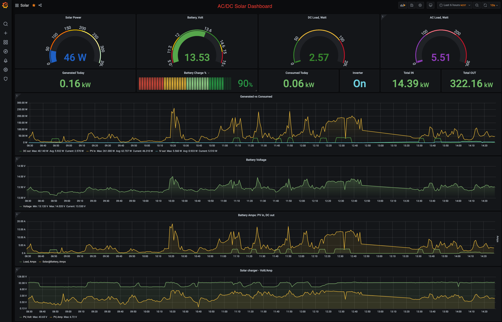

Monitoring EPsolar UPower and Tracer devices from Raspberry Pi with Python via RS-485
===================================================

**EPSolar Tracer** AN/BN devices have been around for a while so this is just another attempt to establish a good monitoring package.

**EPSolar UPower** hybrid inverters are great at what they do, however it is difficult to get them monitored if you have a Linux machine as they are still new and the protocol is not publicly available. Out of my communication with EPSolar I managed to obtain the list of registers and develop a UPower Python module.

## Requirements
- Python 3  (UPower scripts are still running 2.7 as I had no chance to test on UPower device recently)
- Influx DB and its Python 3 modules (use pip3 to install)
- Grafana - latest, whatever is availabe in your Raspbian
- To communicate with the devices you will need [Minimal Modbus](https://minimalmodbus.readthedocs.io/en/stable/) module for Python
- SDM230 device is read using [nmakel/sdm_modbus](https://github.com/nmakel/sdm_modbus)

Make sure you install the Linux driver for Exar USB UART first
--------------------------------------------------------------
The [xr_usb_serial_common-1a](xr_usb_serial_common-1a/) directory contains the makefile and instructions that will compile properly on Rasbian OS with Linux kernels up to v3.5.

Another [xr_usb_serial_common-1a-linux-3.6+](xr_usb_serial_common-1a-linux-3.6+/) directory has the drive for Linux kernels v3.6 and over.

Before compiling be sure to install the linux headers with
`sudo apt-get install raspberrypi-kernel-headers`

After installing the headers be sure to do `make` and `sudo make install`.
The resulting `xr_usb_serial_common.ko` driver file will be moved to `/lib/modules/YOUR_LINUX_KERNEL_VERSION/tty/serial`.

Reboot and enjoy!

If all goes well you should see `ttyXRUSB0` when listing `ls -la /dev/ttyXR*`

Device communications protocols
---------------------
* [Protocol for Epsolar Tracer](epsolar-docs/1733_modbus_protocol.pdf) in this repository

* [Protocol for UPower charger/inverters](epsolars-docs/Upower-communication-protocol-20190411.xlsx) in this repository

Python modules
--------------
Install minimalmodbus first:
`pip install minimalmodbus`

`SolarTracer.py` is the module to communicate with Tracer AN/BN controller
`UPower.py` is for communication with UPower inverters

Logging scripts
--------------
The file `logtracer.py` queries the Tracer AN/BN controller for relevant data and stores into Influx DB.
The file `logtracerstats.py` queries the Tracer AN/BN controller for Statistical data (such as the energy produced over today, last month, year etc.) and stores it into Influx DB.
The file `logupower.py` queries the UPower inverter for relevant data and stores into Influx DB.

By default these scripts write the output into the console (as well as the database). Use > /dev/null to make them "silent".

## Setting up a cron job to run this script regularly:

1. First make `logupower.py` or `logtracer.py` or `logsdmtracer.py` and `logtracerstats.py` executable:

	`sudo chmod +x log*.py`

3. Now add the cron job:

	`crontab -e`

3. add the line to log the values every minute (this is for the Tracer model, choose another logger that suits you):

	`* * * * *  cd /home/pi/epever-upower-tracer && python3 logtracer.py > /dev/null`

4. you can add another line if you want it every half a minute:

	`* * * * *  cd /home/pi/epever-upower-tracer && sleep 30 && python logtracer.py > /dev/null`

6. if you need the statistical values (such as the energy accumulated/generated today, over last month, year and in total) you should add another logger into cron, and this logger DOES NOT have to run every minute. For example, here we have the Statistics logger running every hour:

   	`0 * * * *  cd /home/pi/epever-upower-tracer && ./logtracerstats.py > /dev/null`
   

Grafana Dashboard
--------------------
Some very basic knowledge of InfluxDB and Grafana is assumed here. Please read the documentation for Grafana and Influx to make sure you understand how things fit together. In essense, InfluxDB stores values take out of the controller by the Loggers, and Grafana queries the InfluxDB to display these values in a format you choose over time.

The [grafana/](grafana/) folder contains the dashboard(s) to monitor realtime and historical solar charging data.
The latest one is the [AC_DC_SolarDashboard.json](grafana/AC_DC_SolarDashboard.json) which includes the queries for the SDM230 AC meter.

## Grafana/InfluxDB installation

Use [this guide](https://simonhearne.com/2020/pi-influx-grafana/) to install InfluxDB and Grafana on Raspberry Pi

Run http://raspberrypi.local:3000 (or whatever your name for the Raspberry Pi is) to configure the Grafana console

When you add InfluxDB as a Data Source. Influx DB should be set up with the following parameters:

- user = "grafana"
- pass = "solar"
- db   = "solar"
- host = "127.0.0.1"
- port = 8086

At this point you can also import SolarDashboard from [grafana/](grafana/) folder.

Use "solar" dataset to import the values from when setting up the console.

Additional scripts
------------------
* `getTracerSettings.py` queries settings of the Tracer AN and displays all current voltages
* `setTracerSettings.py` will rewrite Tracer AN/BN voltages to support LiFePO4 batteries.

Current settings in the script are for 24V LiFePO4 (300Ah), however the script can be easily changed to set values for 12V and also other types of batteries. There is a pre-filled array for LiFePO4 and a Lead-Acid flooded battery in the script. See the comments on how to choose it.

See [Battery voltage settings](epsolars-docs/LiFePO4-Settings.xlsx) in this repository
For example,

	`up.setBatterySettings(batteryLiFePO4, 300, 12)`

will set your battery to 300Ah, 12V LiFePO4

* `ivctl.py` may be used to switch the UPower's internal inverter off/on for the night

Tracer with Eastron SDM230
--------------------------

# SDM230 support

[Eastron SDM230](https://www.eastroneurope.com/images/uploads/products/manuals/SDM230_Sereis_Manual.pdf) is a simple meter that measure AC if you have an external inverter.
The [sdm239/](sdm230/) directory contains scripts to query the device.

`logsdmtracer` - is the script that queries both Epever Tracer and the SDM 230 and records into InfluxDB
It adds the Inverter values such as IVvolt, IVwatt and IVison (=1 if the meter is on) into the same `solar` measurement.
