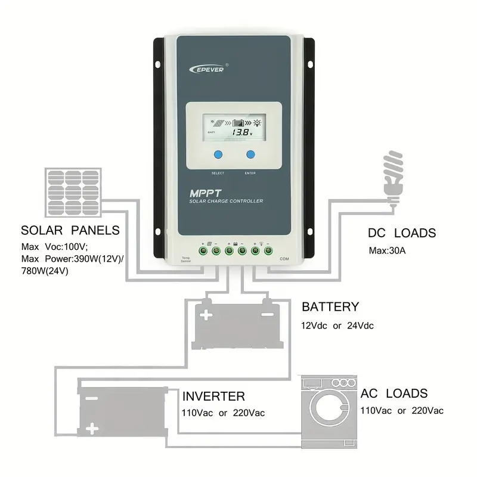
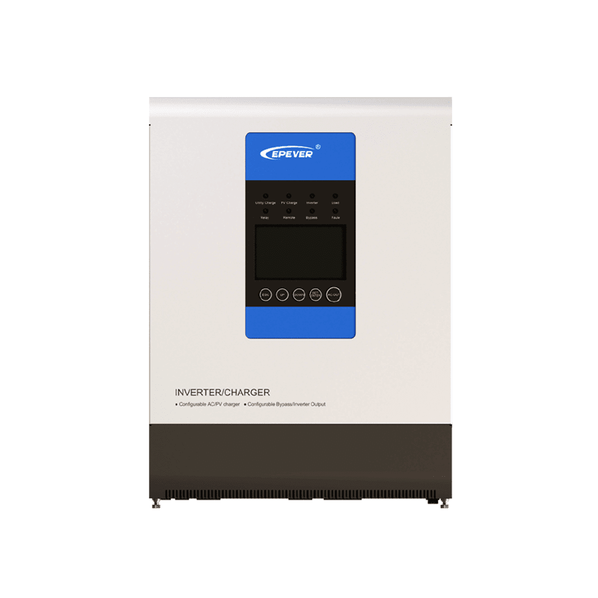
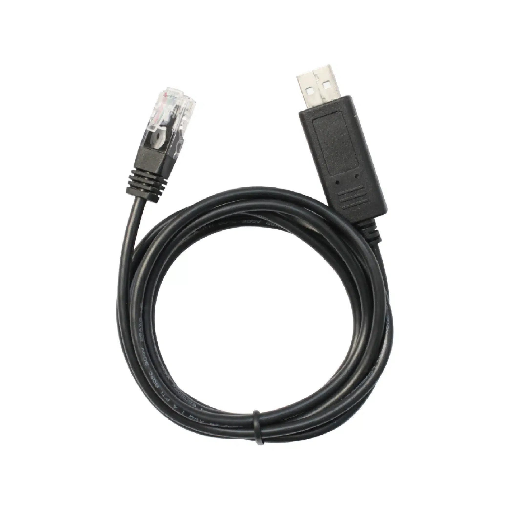

Monitoring EPsolar UPower and Tracer devices from Raspberry Pi with Python via RS-485
===================================================

**EPSolar Tracer** AN/BN devices have been around for a while so this is just another attempt to establish a good monitoring package. This project provides a comprehensive package to configure (set voltages) and query the controller, as well as to display current and statistical values in a timeline using Grafana.

**EPSolar UPower** [hybrid inverters](https://www.epever.com/product/upower-1000-5000w-hybrid-inverter-charger/) are the more recent addition to EPSOLAR family. They are devices combining MPPT chargers and inverters, and they are great at what they do especially in a semi-off-grid situation where AC power is unreliable. However, it is difficult to get them monitored if you have a Linux machine as they are still uncommon and the protocol is not publicly available.

Out of my communication with EPSolar I managed to obtain [the list of registers](epsolars-docs/Upower-communication-protocol-20190411.xlsx) and develop a UPower Python module for monitoring UPower devices.

## Requirements
- Python 3 (note: UPower scripts are still running 2.7 as I had no chance to test on UPower device recently)
- Influx DB and its Python 3 modules (use pip3 to install)
- Grafana - latest, whatever is availabe in your Raspbian
- To communicate with the devices you will need [Minimal Modbus](https://minimalmodbus.readthedocs.io/en/stable/) module for Python
- SDM230 device is read using [nmakel/sdm_modbus](https://github.com/nmakel/sdm_modbus)

Make sure you install the Linux driver for Exar USB UART first
--------------------------------------------------------------

Here it is assumed that you are using the original [Epever CC-USB-RS485-150U PC Communication Cable](https://www.epever.com/product/150u-accessories-communication-cable/), which requires a [Maxlinear Exar Linux driver](https://www.maxlinear.com/support/design-tools/software-drivers) to work. For other USB-RS485 cables/adaptors refer to their manuals as to what kind of driver do you need.

So, your first step is to install the Exar driver. Run `uname -r` command to find out which Linux kernel version you are under.
* [xr_usb_serial_common-1a](xr_usb_serial_common-1a/) directory contains the makefile and instructions that will compile properly on Rasbian OS with Linux kernels up to v3.5.
* [xr_usb_serial_common-1a-linux-3.6+](xr_usb_serial_common-1a-linux-3.6+/) directory has the drive for Linux kernels v3.6 and over.

Before compiling be sure to install the linux headers with
`sudo apt-get install raspberrypi-kernel-headers`

After installing the headers - do `make` and `sudo make install` in the respective driver directory.
The resulting `xr_usb_serial_common.ko` driver file will be moved to `/lib/modules/YOUR_LINUX_KERNEL_VERSION/tty/serial`.

Reboot and enjoy!

If all goes well you should see `ttyXRUSB0` when listing `ls -la /dev/ttyXR*`

If you have more than one Exar USB-RS485 cable plugged in, you will see multiple `ttyXRUSB*` devices. Make sure you set the right device for your EPever in the configuration. The default is `/dev/ttyXRUSB0`.

Other USB-Serial adapters
-------------------------
Please note, this project is designed to use ONLY the official [Epever CC-USB-RS485-150U Serial USB adapter](https://www.epever.com/product/150u-accessories-communication-cable/). The `xr_usb_serial` driver that comes with this project WILL NOT support any other adapter, you will need to find and install the driver suitable for your adapter yourself.

For instance, I had multiple enquiries from people using QinHeng USB adapter. I suggest talking to @bkuschak who managed to get QinHeng adaptor working by altering the code of the Exar driver provided in this project. Apparently the QinHeng uses another byte order. He might be able to share the altered code for the driver suitable for QinHeng. Alternatively, you can buy the Epever Exar adapter from the link above, or just search for "CC-USB-RS485-150U" on AliExpress.

Device communications protocols
-------------------------------
* [Protocol for Epsolar Tracer](epsolar-docs/1733_modbus_protocol.pdf) in this repository

* [Protocol for UPower charger/inverters](epsolars-docs/Upower-communication-protocol-20190411.xlsx) in this repository

Python modules
--------------
Install minimalmodbus first:
`pip install minimalmodbus`

`SolarTracer.py` is the module to communicate with Tracer AN/BN controller
`UPower.py` is for communication with UPower inverters

Logging scripts
--------------
The script `logtracer.py` queries the Tracer AN/BN controller for relevant data and stores into Influx DB.

The script `logtracerstats.py` queries the Tracer AN/BN controller for Statistical data (such as the energy produced over today, last month, year etc.) and stores it into Influx DB.

The script `logupower.py` queries the UPower inverter for relevant data and stores into Influx DB.

By default these scripts write the output into the console (as well as the database). Use > /dev/null to make them "silent".

## Setting up a cron job to run this script regularly:

1. First make `logupower.py` or `logtracer.py` or `logsdmtracer.py` and `logtracerstats.py` executable:

	`sudo chmod +x log*.py`

3. Now add the cron job:

	`crontab -e`

3. add the line to log the values every minute (this is for the Tracer model, choose another logger that suits you):

	`* * * * *  cd /home/pi/epever-upower-tracer && python3 logtracer.py > /dev/null`

4. unfortunately, cron does not understand seconds, however you can add another line if you want it ran every half a minute:

	`* * * * *  cd /home/pi/epever-upower-tracer && sleep 30 && python logtracer.py > /dev/null`

6. if you need the statistical values, such as the energy accumulated/generated today, over last month, year and in total, you must add another logger into cron. This logger DOES NOT have to run every minute. For example, here we have the Statistics logger running every half an hour:

   	`0,30 * * * *  cd /home/pi/epever-upower-tracer && ./logtracerstats.py > /dev/null`

If your logger is set to run every minute - then expect the relevant graphs being up to a minute out of date. Work out your required update period for yourself and update crontab as necessary.
   

Configuration
-------------
Note - for Tracer units the default configuration is now stored in a separate file [InfluxConf.py](InfluxConf.py). Update the parameters if you use other, non-EPEVER USB adapters for RS-485, or if you want to set up your Influx database with some other parametes, or use an existing Influx database.

Grafana Dashboard
--------------------
Some very basic knowledge of InfluxDB and Grafana is assumed here. Please read the documentation for Grafana and Influx to make sure you understand how things fit together. In essense, InfluxDB stores values taken out of the controller by the Loggers, and Grafana queries the InfluxDB to display these historical values in a format you choose.

The [grafana/](grafana/) folder contains the dashboard(s) to monitor realtime and historical solar charging data.
The latest one is the [AC_DC_SolarDashboard.json](grafana/AC_DC_SolarDashboard.json) which includes the queries for the SDM230 AC meter.

## Grafana/InfluxDB installation

Use [this guide](https://simonhearne.com/2020/pi-influx-grafana/) to install InfluxDB and Grafana on Raspberry Pi

Run http://raspberrypi.local:3000 (or whatever your name for the Raspberry Pi is) to configure the Grafana console

When you add InfluxDB as a Data Source. Influx DB should be set up with the following parameters:

- user = "grafana"
- pass = "solar"
- db   = "solar"
- host = "127.0.0.1"
- port = 8086

At this point you can also import SolarDashboard from [grafana/](grafana/) folder.

Use `solar` measurement to import the values from when setting up the console for the current data.
The following values are available in the `solar` measurement when building a Grafana query:

* Generation: voltage, amperage and power - `PVvolt`, `PVamps`, `PVwatt`
* Consumption: voltage, amperage and power - `DCvolt`, `DCamps`, `DCwatt`
* Battery: `BAvolt`, `BAamps`, `BAwatt` respectively
* Additional battery parameters: `BAtemp` (if the thermometer is connected), `BAperc` percentage of charge, `BAstat` battery status, `BAcur` battery current (could be positive or negative, depending what prevails - generation or consumption)

Use `solar_stats` measurement for the statistical values. Once you have your Statistical logger running, you will see this additional measurement in your InfluxDB. 

These are the values you can select from `solar_stats`, when you build your Grafana query:

* `DCkwh2d` - DC power consumed today
* `DCkwhTT` - DC power consumed in ToTal
* `DCkwhTY` - DC power consumed This Year
* `DCkwhTm` - DC power consumed This Month
* `PVkwh2d` - Solar power generated today
* `PVkwhTT` - Solar power generated in ToTal
* `PVkwhTY` - Solar power generated This Year
* `PVkwhTm` - Solar power generated This Month

Additional scripts
------------------
* `getTracerSettings.py` queries settings of the Tracer AN and displays all current voltage settings
* `setTracerSettings.py` will rewrite Tracer AN/BN voltages (to support LiFePO4 batteries for example).

Current settings in the script are for 12V LiFePO4 160Ah battery, however the script can be easily modified to set values for 24V and also other types of batteries.
There is a pre-filled array for LiFePO4 and a Lead-Acid flooded battery in the script.

See [Battery voltage settings](epsolars-docs/LiFePO4-Settings.xlsx) in this repository with the default settings from Victron.

See the comments in the script itself show how to choose the battery parameters. For instance,

	tracer.setBatterySettings(batteryLiFePO4, 300, 24)

will set your battery to 300Ah 24V LiFePO4, and

	tracer.setBatterySettings(batteryLeadAcid, 200, 12)

will set it to 200Ah 12V Lead-Acid battery

* `ivctl.py` may be used to switch the UPower's internal inverter off/on for the night

Tracer with Eastron SDM230
--------------------------

# SDM230 support

[Eastron SDM230](https://www.eastroneurope.com/images/uploads/products/manuals/SDM230_Sereis_Manual.pdf) is a simple meter that measures AC consumption if you have an external inverter. Connect it between the inverter and the load, and you can have another data stream from your AC devices under the same dashboard.

The [sdm239/](sdm230/) directory contains scripts to query the device.

`logsdmtracer.py` - is the script that queries both Epever Tracer and the SDM 230 and records into InfluxDB
It adds another measurement `acpower` with the Inverter values such as `IVvolt`, `IVamps`, `IVwatt` and `IVison` (=1 if the meter is on).
